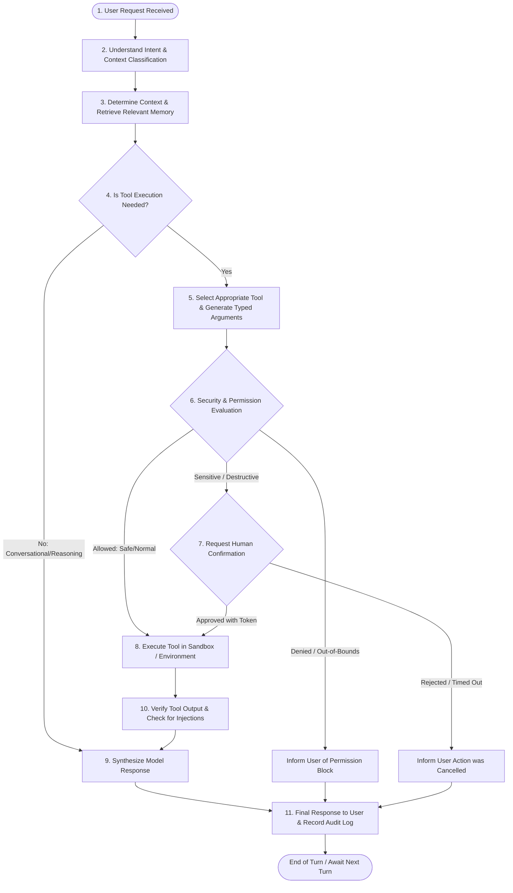

# JARVIS Agent Execution Loop

> **Phase 0 — Safe Development Specification**

This document specifies the deterministic, step-by-step agent execution loop that governs how **JARVIS** processes user requests, evaluates safety, selects and executes tools, verifies results, and audits every state transition.

---

## 1. The 11-Step Agent Pipeline

---

## 2. Detailed Step Specifications

### Step 1: User Request Ingestion
- Ingest user input via Text UI, Desktop Hotkey prompt, or Voice STT stream.
- Assign a unique `turn_id` and timestamp.
- Normalize and sanitize encoding.

### Step 2: Intent Parsing & Context Classification
- Parse the semantic objective of the request.
- Classify request domain: `Knowledge / Conversation`, `Code / Project Assist`, `System Operation`, `Communication`, `Research`.
- Determine formality and privacy context:
  - Private context $\rightarrow$ address user as **"Suprith"**.
  - Formal / public context $\rightarrow$ address user as **"Sir"**.
  - Never assume physical solitude unless explicitly confirmed by context.

### Step 3: Context Assembly & Memory Retrieval
- Retrieve active working memory (recent dialogue turns).
- Query local episodic memory vector store for relevant user preferences or project context.
- Assemble prompt context within token budget, strictly delineating system instructions from user inputs.

### Step 4: Tool Requirement Decision
- Evaluate if the request can be fulfilled through direct reasoning or requires an external tool.
- If purely conversational $\rightarrow$ bypass tool execution directly to **Step 9**.

### Step 5: Tool Selection & Schema Generation
- Match intent against registered tool capability schemas.
- The model generates a strictly typed JSON argument payload adhering to the tool's Pydantic schema.

### Step 6: Security & Permission Check
- Pass the requested tool and proposed parameters to the `PermissionEngine`:
  - Check active permission tier (`LOCKED`, `NORMAL`, `SENSITIVE`).
  - Validate parameters against resource whitelists (e.g., path boundaries).
  - Verify active system privacy mode.

### Step 7: Human Confirmation Gate (HITL)
- If the action is classified as `SENSITIVE`, `DESTRUCTIVE`, or `IRREVERSIBLE`:
  - Construct a structured `ApprovalCard` (Action, Target, Diff/Payload, Risk).
  - Present modal to user and await signed `ApprovalToken`.
  - Fail-closed if rejected or timed out after 60s.

### Step 8: Sandboxed Tool Execution
- Execute the tool inside the isolated sandbox (or approved host runtime in later phases).
- Enforce strict CPU/memory limits and timeout timers (max 30s).
- Capture `stdout`, `stderr`, and structured return payload.

### Step 9: Result Verification & Injection Defense
- Pass tool output through `PromptGuard` and `Sanitizer`:
  - Strip terminal escape sequences and non-printable characters.
  - Detect indirect prompt injection attempts inside fetched web pages or emails.
  - Wrap raw tool output in `<untrusted_external_content>` tags before returning it to the LLM context.

### Step 10: Response Synthesis & Reasoning
- Send the assembled context and sanitized tool results to the `ModelRouter` (Fast, Reasoning, or Local tier).
- Model synthesizes the final answer, explaining results clearly and disagreeing politely with the user if a logical/technical error is detected.

### Step 11: Response Delivery & Audit Logging
- Deliver response to the client UI (and TTS voice synthesizer if voice mode is active).
- Record the entire transaction in the SHA-256 chained `logs/audit.log` (storing turn ID, model tier used, tool called, parameters, approval token ID, and outcome).
