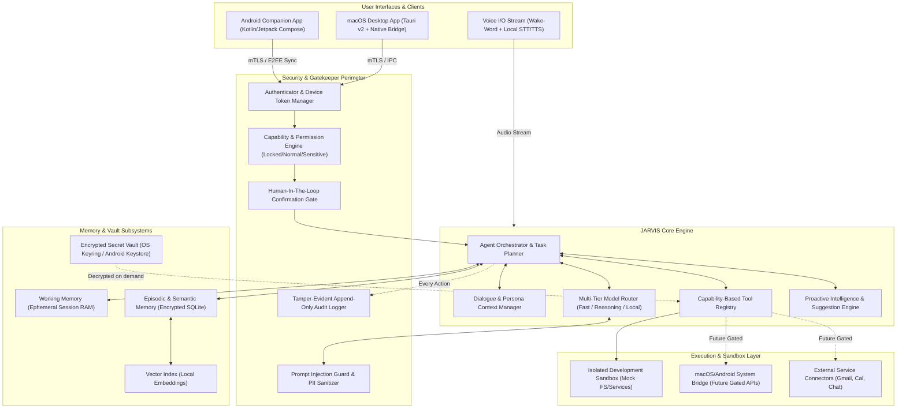

# JARVIS System Architecture

> **Phase 0 — Safe Development Specification**

This document describes the high-level system architecture, component topology, inter-process communication (IPC), cross-platform synchronization, and design principles of **JARVIS**.

---

## 1. Architectural Principles

1. **Safety-First & Fail-Closed**: Every subsystem is designed assuming potential failure or compromise. If a component cannot verify security or permission status, it immediately defaults to a safe, closed state.
2. **Platform Native & Lightweight**: JARVIS uses native OS capabilities (macOS AppKit/Tauri and Android Jetpack Compose) for frontend presentation and system integration, while retaining a unified core engine.
3. **Strict Separation of Concerns**: Core intelligence, memory, security enforcement, model routing, and platform adapters are isolated behind typed abstract interfaces.
4. **Zero Cloud Lock-in**: All external AI providers are abstracted through a multi-tier model router, allowing transparent switching between cloud models (Gemini, Claude, GPT) and fully offline local models (Llama.cpp, Ollama, vLLM).
5. **Decoupled Client-Server IPC**: The JARVIS Core Daemon runs independently from desktop and mobile client shells, communicating via authenticated, encrypted channels.

---

## 2. High-Level System Architecture

---

## 3. Subsystem Breakdown

### 3.1. Client Interfaces
- **macOS Desktop**: Built with Tauri v2 (Rust shell) providing system tray residency, global hotkeys, floating HUD, and native Swift bridge for macOS Accessibility APIs and AppleScript automation.
- **Android Companion App**: Built natively with Kotlin and Jetpack Compose. Synchronizes encrypted state and notifications with the primary desktop engine over secure peer-to-peer or local network connections.
- **Voice Pipeline**: Abstract interface supporting offline wake-word ("Hey Jarvis"), on-device streaming speech-to-text (Whisper/Moonshine), and expressive text-to-speech.

### 3.2. Security Perimeter
- **Authenticator & Session Manager**: Issues cryptographically signed, short-lived session tokens for connected devices and local IPC clients.
- **Permission Engine**: Enforces the 3-tier capability model (`LOCKED`, `NORMAL`, `SENSITIVE`) and inspects tool invocation parameters.
- **Human-In-The-Loop (HITL) Gatekeeper**: Intercepts any action classified as sensitive, destructive, or irreversible, generating a structured dry-run approval card that must be confirmed by the human owner.
- **Audit Logger**: Writes SHA-256 chained, append-only logs for all prompt submissions, tool invocations, security decisions, and error events.

### 3.3. Core Engine & Agent Loop
- **Agent Loop**: Coordinates intent parsing, reasoning, tool selection, pre-execution verification, post-execution sanitization, and response generation.
- **Dialogue & Persona Manager**: Governs personality, ensuring a calm, professional, slightly witty tone, addressing the user as "Suprith" in private contexts and "Sir" in formal/public contexts.
- **Proactive Intelligence**: Periodically evaluates project states, task lists, and calendar cues to propose helpful optimizations, drafts, and plans without performing unapproved actions.

### 3.4. Model Routing Subsystem
- **Provider-Agnostic Abstraction**: Dispatches requests across three logical tiers:
  1. `FastTier`: Low-latency conversational responses and lightweight categorization.
  2. `ReasoningTier`: Deep multi-step task planning, complex code generation, and research synthesis.
  3. `LocalPrivateTier`: Fully offline processing for confidential documents, passwords, and sensitive memory indexing.
- **Prompt Sanitizer & PII Guard**: Redacts sensitive entities (emails, API keys, credentials) before prompt dispatch to external cloud endpoints.

### 3.5. Memory Architecture
- **Working Memory**: Ephemeral in-memory scratchpad per conversation session.
- **Episodic & Semantic Memory**: Persistent relational and vector storage encrypted with AES-256 (SQLCipher), supporting user-approved indexing, granular inspection, and right-to-be-forgotten deletion.
- **Secret Vault**: Integration with macOS Keychain and Android Keystore for zero-knowledge credential isolation.

### 3.6. Sandbox Subsystem
- **Mock Virtual Filesystem**: In-memory and directory-scoped mock storage providing synthetic documents, logs, and projects.
- **Synthetic External Services**: Mock implementations of Gmail, Google Calendar, Apple Calendar, WhatsApp, and Telegram for safe end-to-end development without touching real production APIs.

---

## 4. Cross-Device Synchronization Protocol (Future Design)

For secure synchronization between macOS and Android:
1. **Device Pairing**: Uses an out-of-band QR code exchange containing an ephemeral Curve25519 public key and one-time SAS (Short Authentication String).
2. **Transport**: Local network mTLS with WebRTC DataChannels for low-latency peer-to-peer sync when on the same LAN; end-to-end encrypted relay for remote sync.
3. **Data Replication**: Conflict-Free Replicated Data Types (CRDTs) for shared task lists, notes, and memory graphs. Master keys never leave the primary macOS device.

---

## 5. Technology Stack Summary & Justifications

| Layer | Selected Technology | Primary Rationale |
|---|---|---|
| **Core Daemon** | Python 3.12+ (Asyncio, Pydantic v2, MyPy Strict) | Richest AI/ML ecosystem, rapid development, strong typing, clean cross-platform runtime. |
| **Desktop Shell** | Tauri v2 (Rust + Webview) | Lightweight (<20MB RAM vs 200MB+ Electron), memory safe, native OS capabilities, Stitch-compatible UI. |
| **Android Client**| Kotlin + Jetpack Compose | Modern native Android architecture, Hardware Keystore integration, background WorkManager. |
| **Storage & Memory**| SQLite + SQLCipher + Qdrant Embedded | Zero external server dependency, AES-256 encryption at rest, sub-millisecond vector indexing. |
| **Inter-Process Comm**| Unix Domain Sockets + JSON-RPC / gRPC | High throughput, local permission isolation, zero open network ports on host. |
| **Voice Processing**| OpenWakeWord / Whisper / Piper (Local) | Complete privacy, offline availability, zero continuous audio telemetry. |
