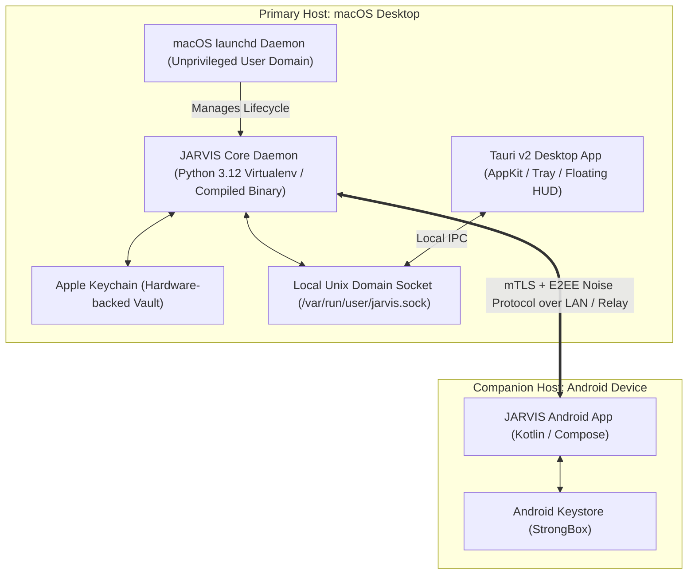
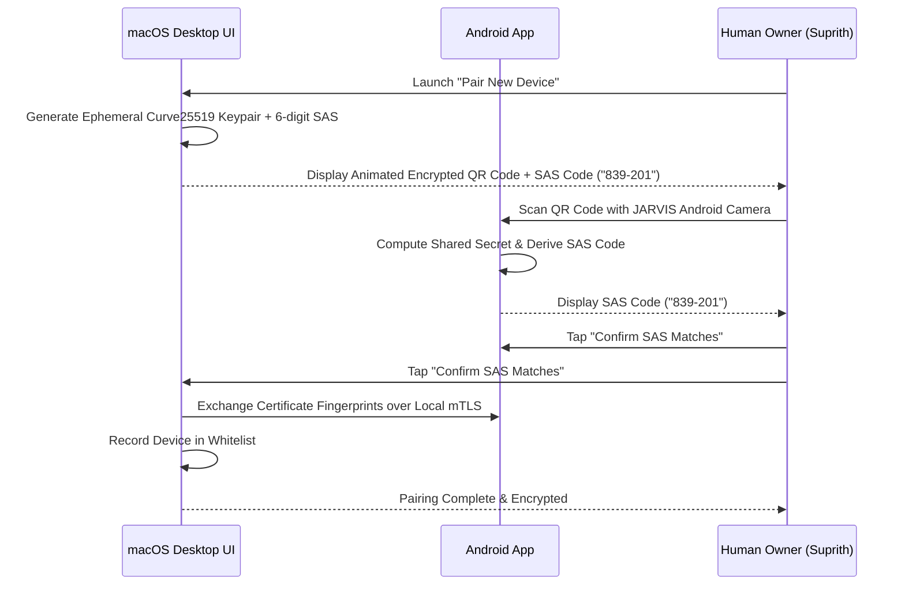

# JARVIS Deployment, Packaging & Operational Architecture

> **Phase 0 — Safe Development Specification**

This document specifies the packaging formats, installation topologies, local daemon lifecycle management, cross-device pairing procedures, and operational guardrails for **JARVIS**.

---

## ⚠️ Phase 0 Deployment Prohibition

**No services, daemons, background agents, or applications are deployed to the host machine during Phase 0.**
Real device connection and deployment occurs exclusively in **Phase 13** following explicit human authorization.

---

## 1. Deployment Topology

---

## 2. Platform Packaging & Installation

### 2.1. macOS Desktop Application
- **Packaging Format**: Signed and Notarized `.dmg` / Universal Binary (Apple Silicon `arm64` + Intel `x86_64`).
- **Sandbox Entitlements**:
  - Sandboxed with user-selected directory read/write (`com.apple.security.files.user-selected.read-write`).
  - Network client (`com.apple.security.network.client`).
  - Keychain access (`keychain-access-groups`).
- **Daemon Lifecycle (`launchd`)**:
  - Installed under `~/Library/LaunchAgents/com.jarvis.core.plist` (User domain, never root).
  - Starts upon user login; stops upon logout or emergency kill switch.

### 2.2. Android Companion Application
- **Packaging Format**: Signed Android Package (`.apk` / `.aab`).
- **Security Scopes**:
  - Hardware-backed biometric authentication (Android BiometricPrompt).
  - Background synchronization managed via Jetpack WorkManager with exponential backoff and battery optimization.

---

## 3. Secure First-Time Onboarding & Pairing Ceremony

---

## 4. Disaster Recovery & Emergency Protocols

1. **Host Migration & Backup**:
   - The user can export an encrypted zero-knowledge backup of episodic memory (`jarvis backup export --out backup.jrvs`).
   - Backup is encrypted using Argon2id + ChaCha20-Poly1305 with the user's master passphrase.
2. **Emergency Kill Switch**:
   - Global hotkey `Cmd + Shift + Esc` immediately terminates all active agent processes.
   - Deleting the paired device entry from the desktop control panel instantly revokes all sync tokens.
