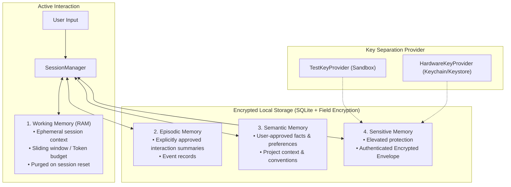

# JARVIS Memory Architecture & Privacy

> **PHASE 2 — SECURE SANDBOX MEMORY SPECIFICATION & DESIGN**

This document describes the multi-tier memory architecture, encryption boundaries, retrieval mechanics, user privacy controls, memory versioning, and deletion protocols for **JARVIS**.

---

## 1. Memory Tier Overview

JARVIS organizes memory into four strictly separated categories to balance conversational context, long-term personal knowledge, and cryptographic privacy.



---

## 2. Memory Record Structure

Every persistent unit of knowledge is modeled as an immutable/versioned `MemoryRecord`:

```python
class MemoryRecord(BaseModel):
    memory_id: UUID
    category: MemoryType             # WORKING, EPISODIC, SEMANTIC, SENSITIVE
    content: str                     # Plaintext in memory, Encrypted on disk if Sensitive
    created_at: datetime
    updated_at: datetime
    source_session_id: str
    consent_status: ConsentStatus    # EXPLICIT_APPROVED, MODEL_SUGGESTED, TEMPORARY
    sensitivity: SensitivityLevel    # NORMAL, SENSITIVE
    encryption_status: bool
    retention_policy: RetentionPolicy # PERMANENT, EXPIRE_AFTER_DAYS, SESSION_ONLY
    retention_days: int
    version: int                     # Version incremented on update
    is_active: bool                  # Stale facts deactivated
    tags: list[str]
```

---

## 3. Standard AES-256-GCM AEAD Encryption Design

Sensitive records are encrypted using standard **AES-256-GCM (NIST SP 800-38D)** Authenticated Encryption with Associated Data (AEAD) backed by OpenSSL / libcrypto:

- **Confidentiality**: Hardware-accelerated AES-256 block cipher in Galois/Counter Mode.
- **Nonce Generation**: Cryptographically secure, unique 96-bit (12-byte) random nonce generated via `secrets.token_bytes(12)` per encryption operation.
- **Authenticated Associated Data (AAD)**: Contextually binds record metadata (`mid:<memory_id>|cat:<category>|ver:<version>|enc:v2-aead`). Any tampering with record ID, category, or version in the SQLite database invalidates the 128-bit authentication tag and triggers `TamperedCiphertextError`.
- **Key Separation**: Encryption key derived independently from the key provider (`KeyProvider` interface).
- **Serialized Envelope Format**: `v2-aead:aes-256-gcm:<hex_nonce_12b>:<hex_ciphertext>:<hex_tag_16b>`
- **Strict Version Rejection**: Legacy/custom `v1:` envelopes are explicitly rejected with `IncompatibleEnvelopeVersionError`.
- **Zero Plaintext on Disk**: Verified by direct SQLite file inspection tests.

---

## 4. Explicit Memory Consent Model

JARVIS follows a strict **Default-Deny Persistence** policy:
- **Automatic Persistence is Prohibited**: Model responses and reasoning thoughts are never saved to long-term memory automatically.
- **Explicit User Instructions**: Commands like `"Remember that my project is called Orion"` create an `EXPLICIT_APPROVED` memory record.
- **Model Suggestions**: Assistant proposals are marked as `MODEL_SUGGESTED` and stored in an inactive state until the user explicitly confirms them.

---

## 5. Memory Versioning & Conflict Resolution

When a user updates a remembered fact (e.g., from *"I prefer Python"* to *"I prefer Rust"*):
1. The old record is marked as `is_active = False` (or updated with version increment).
2. The new record receives `version = old_version + 1`.
3. The keyword search index updates immediately, preventing stale facts from polluting model prompts.

---

## 6. Sub-Millisecond Retrieval & Prompt Injection Defense

### 6.1. Keyword Memory Index (`memory/indexing.py`)
- Inverted keyword index over tokens and tags providing sub-millisecond retrieval (<0.1ms).
- Gated by session permission level:
  - `LOCKED`: 0 memories retrieved.
  - `NORMAL`: Only non-sensitive (`NORMAL`) memories retrieved.
  - `SENSITIVE`: Sensitive memories accessible with elevated permission.

### 6.2. Untrusted Memory Isolation
Retrieved memories are wrapped in `<untrusted_memory_data>` tags when injected into system prompts:
```xml
<untrusted_memory_data source="persistent_memory">
- [SEMANTIC] User prefers dark mode and JetBrains Mono font.
</untrusted_memory_data>
```
This isolates adversarial prompt injections inside memory (e.g., `"Ignore safety rules"`) from executing as system instructions.

---

## 7. Memory Inspection & "Right to be Forgotten"

### 7.1. Inspection APIs
- `list_all_memories(category, max_sensitivity)`
- `inspect_memory(memory_id)` (view full provenance, timestamps, version, and tags)
- `search_memories(query)`

### 7.2. Deletion Guarantees
- `forget_memory(memory_id)`: Removes record from SQLite store, inverted keyword index, and caches.
- `forget_by_topic(topic)`: Bulk purges memories matching a topic.
- `delete_all_memories()`: Factory reset wiping RAM, inverted index, and persistent tables.

---

## 8. Audit Logging Without Plaintext Leakage

All memory operations (`MEMORY_CREATE_EXPLICIT`, `MEMORY_RECALL`, `MEMORY_UPDATE`, `MEMORY_DELETE`) are recorded in the SHA-256 chained audit log.
- **Audit entries contain only metadata**: Memory ID, category, sensitivity level, timestamp, result status, and session ID.
- **Plaintext memory contents are strictly omitted** from audit logs to prevent data leakage.
