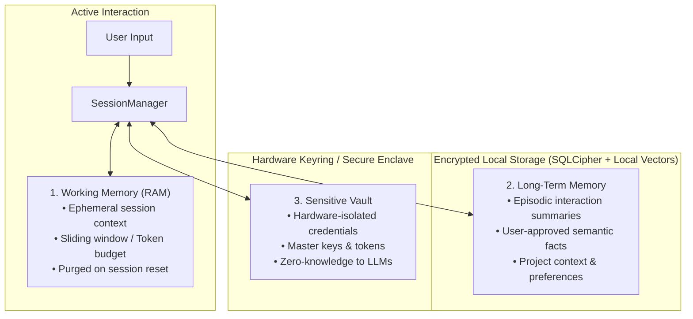
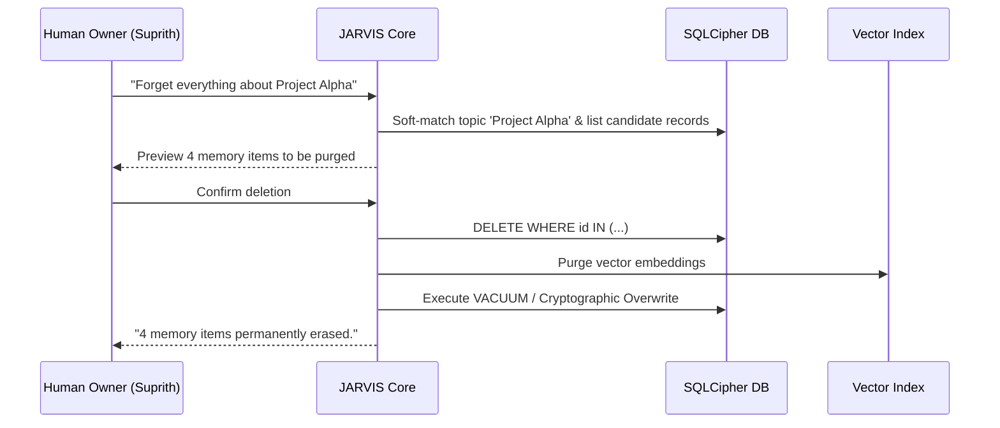

# JARVIS Memory Architecture & Privacy

> **Phase 0 — Safe Development Specification**

This document describes the multi-tier memory architecture, encryption boundaries, retrieval mechanics, user privacy controls, and memory deletion protocols for **JARVIS**.

---

## 1. Memory Tier Overview

JARVIS organizes memory into three strictly separated tiers to balance conversational context, long-term personal knowledge, and cryptographic privacy.



---

## 2. Detailed Memory Subsystems

### 2.1. Working Memory (Ephemeral / In-RAM)
- **Lifecycle**: Exists solely in memory during an active conversation session.
- **Components**:
  - Raw dialogue turns (user queries, assistant replies).
  - Scratchpad for multi-step reasoning thoughts.
  - Active tool call results and intermediate buffers.
- **Security & Privacy**:
  - Automatically flushed when the session times out (default: 60 minutes of inactivity) or when the user invokes "Clear session / Start fresh".
  - Never serialized to disk in plaintext.

### 2.2. Long-Term Memory (Episodic & Semantic)
- **Lifecycle**: Persisted locally in an encrypted database (`data/memory.db` via SQLCipher with AES-256-GCM).
- **Sub-types**:
  1. **Episodic Memory**: High-level summaries of past conversations, key decisions, and completed tasks.
  2. **Semantic Knowledge Graph**: Explicit facts and preferences learned over time (e.g., preferred coding styles, project naming conventions).
- **Indexing & Retrieval**:
  - Uses local dense vector embeddings (e.g., all-MiniLM-L6-v2 via ONNX / SQLite-VSS) running completely on-device.
  - Semantic retrieval queries are executed locally without sending memory databases to external embedding APIs.
- **User-Approved Write Policy**:
  - The model does not silently write facts to persistent memory without either explicit user confirmation or transparent UI notification with an "Undo" action.

### 2.3. Sensitive Vault (Zero-Knowledge Isolation)
- **Scope**: Passwords, API tokens, OAuth credentials, and cryptographic keys.
- **Enforcement**:
  - **Inaccessible to LLM context**: Model prompts NEVER receive plaintext secrets.
  - Stored inside the native OS Keyring (macOS Keychain / Android Keystore).
  - Tools that require authentication receive transient handles or are executed by trusted backend proxies that inject the secret directly at the network transport layer without exposing it to the agent context.

---

## 3. Memory Inspection & Transparency

JARVIS adheres to complete transparency regarding what it remembers:

### 3.1. Inspection Interface
The user can inspect all stored memories via the UI memory dashboard or the CLI:

```bash
# List all remembered facts by category
jarvis memory list --category preferences

# Search memory for a specific topic
jarvis memory search "Python project structure"

# Inspect detailed provenance of a memory item
jarvis memory inspect <memory_id>
```

Each memory record stores:
- `id`: Unique UUID
- `content`: Plain text summary of the remembered fact
- `category`: `preference`, `project`, `task`, `fact`
- `created_at`: Timestamp
- `source_session_id`: Originating session
- `confidence_score`: Float value (0.0 - 1.0)

---

## 4. Memory Deletion & "Right to be Forgotten"

JARVIS provides fine-grained, cryptographically sound deletion protocols:



### 4.1. Deletion Commands
- **Targeted Deletion**: `jarvis memory delete <memory_id>`
- **Topic Wipe**: `jarvis memory wipe --topic "Project X"`
- **Total Factory Reset**: `jarvis memory reset --all --confirm` (destroys SQLite database, vector index, and regenerates database encryption keys).

---

## 5. Privacy & Data Minimization Constraints

1. **No Cloud Memory Synching without E2EE**: Persistent memory synced between macOS and Android is encrypted on the client using keys derived from the user's master secret before transmission.
2. **No Persistent Sensitive Data in Phase 0**: The repository and its test suites operate strictly on synthetic mock data (`sandbox/fixtures/`).
