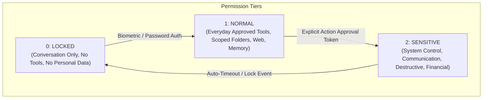
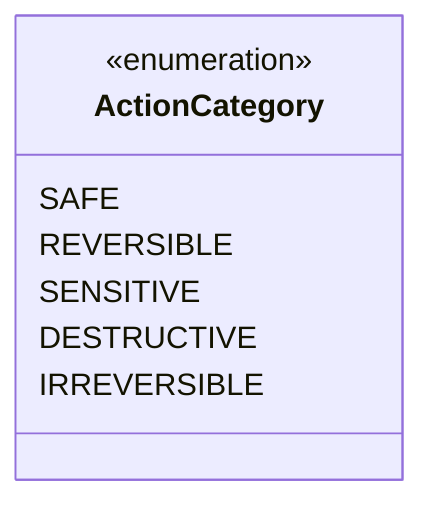

# JARVIS Permission Model & Action Policies

> **Phase 0 — Safe Development Specification**

This document specifies the capability-based permission model, action classification taxonomy, dynamic policy evaluation rules, and the human confirmation gatekeeper protocol for **JARVIS**.

---

## 1. Conceptual Permission Levels

JARVIS operates across three discrete, hierarchically structured permission tiers.



### 1.1. Level 0: LOCKED
- **Scope**: Purely conversational and analytical in-memory reasoning.
- **Allowed Operations**:
  - General knowledge question answering
  - Synthesizing or formatting user-provided prompt text
  - Ephemeral calculations and logic
- **Blocked Operations**:
  - No filesystem reading or writing
  - No web search or outbound network calls
  - No tool execution
  - No access to persistent personal memory or secret vault

### 1.2. Level 1: NORMAL
- **Scope**: Safe, everyday read-only and bounded productivity operations.
- **Allowed Operations**:
  - Read-only access to user-whitelisted project folders (and `sandbox/` in development)
  - Public web searches and reading public articles
  - Ephemeral working memory and user-approved episodic memory recall
  - Reading calendar schedule (read-only)
  - Generating proactive suggestions and study/task plans
- **Blocked Operations**:
  - No file modifications, deletions, or creations outside temporary scratchpads
  - No external communication (no sending emails, SMS, or chat messages)
  - No system settings modifications
  - No execution of arbitrary shell scripts or host binaries

### 1.3. Level 2: SENSITIVE
- **Scope**: High-impact, system-level, financial, communication, and modifying actions.
- **Enforcement**: **Always gated by an interactive Human-In-The-Loop (HITL) confirmation modal.**
- **Allowed Operations** (with explicit per-action user approval):
  - Sending emails, SMS, WhatsApp, or Telegram messages
  - Creating, editing, or deleting files in user repositories
  - Running verified command-line builds, tests, or scripts
  - Modifying application or system preferences
  - Interacting with authenticated third-party service write APIs

---

## 2. Action Classification Taxonomy

Every tool and action registered in JARVIS must declare a static `ActionCategory`.



| Category | Definition | Confirmation Required? | Examples |
|---|---|---|---|
| `SAFE` | Read-only operations with no external side-effects | ❌ No | Web search, reading a documentation file, checking the time |
| `REVERSIBLE` | Modifying actions that can be cleanly undone automatically | ⚠️ Policy Dependent (Default: No for sandbox, Yes for host) | Creating a scratch file in temp, adding a draft to local buffer |
| `SENSITIVE` | Actions that communicate externally or modify personal data | ✅ **YES (Always)** | Sending an email, sending a chat message, sharing personal info |
| `DESTRUCTIVE` | Actions that permanently alter or delete local data | ✅ **YES (Always)** | Deleting files, modifying database tables, overwriting configs |
| `IRREVERSIBLE` | High-impact actions that cannot be undone or refunded | ✅ **YES (Dual-Confirm)** | Making purchases, permanently deleting accounts, flashing firmware |

---

## 3. Operations Explicitly Requiring Human Confirmation

Under no circumstance may JARVIS execute any of the following actions autonomously without explicit user approval:

1. **Communication**:
   - Sending an email (Gmail connector)
   - Sending a message (WhatsApp, Telegram, SMS)
   - Posting to social platforms (Instagram)
2. **Filesystem & Data Mutations**:
   - Deleting any file or directory
   - Modifying files outside the current active project directory
   - Overwriting configuration files
3. **Security & Identity**:
   - Accessing, displaying, or modifying passwords, API tokens, or SSH keys
   - Granting new permissions to devices or applications
   - Changing security policies or disabling guardrails
4. **System Control**:
   - Running terminal commands or shell scripts
   - Installing software packages or updating system settings
   - Creating background startup services or scheduled cron jobs
5. **Privacy & Exfiltration**:
   - Uploading local private documents or codebases to external APIs
   - Sharing sensitive personal information across communication channels
6. **Financial**:
   - Authorizing payments, purchases, subscriptions, or fund transfers

---

## 4. The Dynamic Permission Evaluation Pipeline

Before any tool is executed by the agent loop, the request passes through the **PermissionEngine**:

```python
# Conceptual Verification Logic
def evaluate_tool_permission(
    session: SessionContext,
    tool: BaseTool,
    params: dict,
    approval_token: ApprovalToken | None
) -> PermissionDecision:
    # Rule 1: Check baseline tier
    if session.permission_level.value < tool.required_level.value:
        return PermissionDecision.DENIED_INSUFFICIENT_LEVEL

    # Rule 2: Check action category
    if tool.action_category in [ActionCategory.SENSITIVE, ActionCategory.DESTRUCTIVE, ActionCategory.IRREVERSIBLE]:
        if approval_token is None or not approval_token.is_valid_for(tool.name, params):
            return PermissionDecision.REQUIRES_HUMAN_CONFIRMATION

    # Rule 3: Check resource whitelist (e.g. file paths)
    if not is_resource_authorized(tool, params, session.active_whitelist):
        return PermissionDecision.DENIED_RESOURCE_OUT_OF_BOUNDS

    # Passed all rules
    return PermissionDecision.AUTHORIZED
```

---

## 5. Approval Token Lifecycle

To prevent replay attacks, unauthorized privilege elevation, or race conditions:

1. **Generation**: When a sensitive action is identified, JARVIS generates a cryptographic `ApprovalCard` with a unique UUID, SHA-256 hash of all tool arguments, and a 60-second expiration timestamp.
2. **Display**: The UI presents a modal dialog displaying the full diff, target, and impact.
3. **Sign-off**: When the user clicks "Approve", the client signs the approval card using the local session key, producing a single-use `ApprovalToken`.
4. **Consumption**: The Core engine verifies the signature, matches the argument hash, executes the tool once, and immediately burns (invalidates) the token.
5. **Audit**: The approval and token ID are permanently recorded in `logs/audit.log`.
