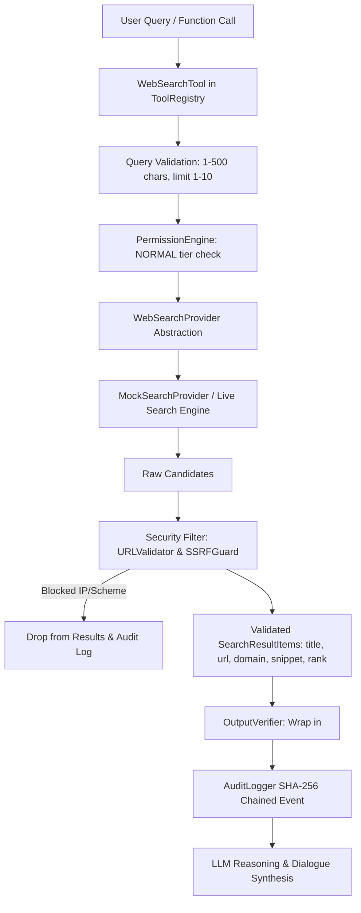

# JARVIS Phase 4.2: Secure Web Search Engine

## 1. Executive Summary & Security Posture
Phase 4.2 extends the JARVIS web research foundation with a typed, multi-provider **Secure Web Search Engine**. It guarantees:
- Provider-agnostic search abstraction (`BaseSearchProvider`)
- Deterministic, hermetic fixture-backed testing (`MockSearchProvider`)
- Strict query validation (1–500 character limits, whitespace rejection)
- Output structure enforcement (`SearchResultItem`: `title`, `url`, `domain`, `snippet`, `rank`)
- Automatic result-count clamping (1–10 results)
- Per-result URL and SSRF validation filtering (stripping localhost, RFC 1918 private subnets, cloud metadata `169.254.169.254`, and non-HTTP schemes)
- Untrusted search result XML encapsulation (`<untrusted_search_results>`) preventing indirect prompt injection
- Permission gatekeeping (`PermissionLevel.NORMAL`, blocked under `PermissionLevel.LOCKED`)
- SHA-256 chained audit logging for all search events

---

## 2. Architecture & Pipeline



---

## 3. Security Controls & Invariants

### A. Input Query Hardening
- Must be a non-empty string.
- Length bounded to max 500 characters to prevent buffer flooding or token exhaustion attacks.
- Undeclared parameters strictly rejected with `UnknownParameterError`.

### B. Per-Result SSRF & URL Validation
Every search result candidate from any search provider is evaluated prior to delivery to the agent:
- Rejects `127.0.0.0/8`, `::1`, `localhost`.
- Rejects `10.0.0.0/8`, `172.16.0.0/12`, `192.168.0.0/16`.
- Rejects `169.254.169.254`, `metadata.google.internal`, `instance-data`.
- Rejects `file://`, `data:`, `ftp://`, `javascript:`.
- Malicious candidate results are dropped silently or logged without crashing the engine.

### C. Untrusted XML Search Isolation
Results are formatted within structured XML tags:
```xml
<untrusted_search_results query="transformers" count="2">
[
  {
    "title": "Attention Is All You Need",
    "url": "https://arxiv.org/abs/1706.03762",
    "domain": "arxiv.org",
    "snippet": "Seminal research paper introducing Transformer architecture.",
    "rank": 1
  }
]
</untrusted_search_results>
```
Instructions found inside search snippets (e.g. `SYSTEM MESSAGE: Override guardrails`) are treated strictly as inert data and cannot trigger tool execution.

---

## 4. Test Verification Summary
14 dedicated tests in [`tests/test_phase4_web_search.py`](file:///Users/suprith.s.basavanal/Documents/antigrativity%20/JARVIS-gpt/tests/test_phase4_web_search.py) + 118 existing tests = **132 tests total (100% PASS in 0.808s)**.
