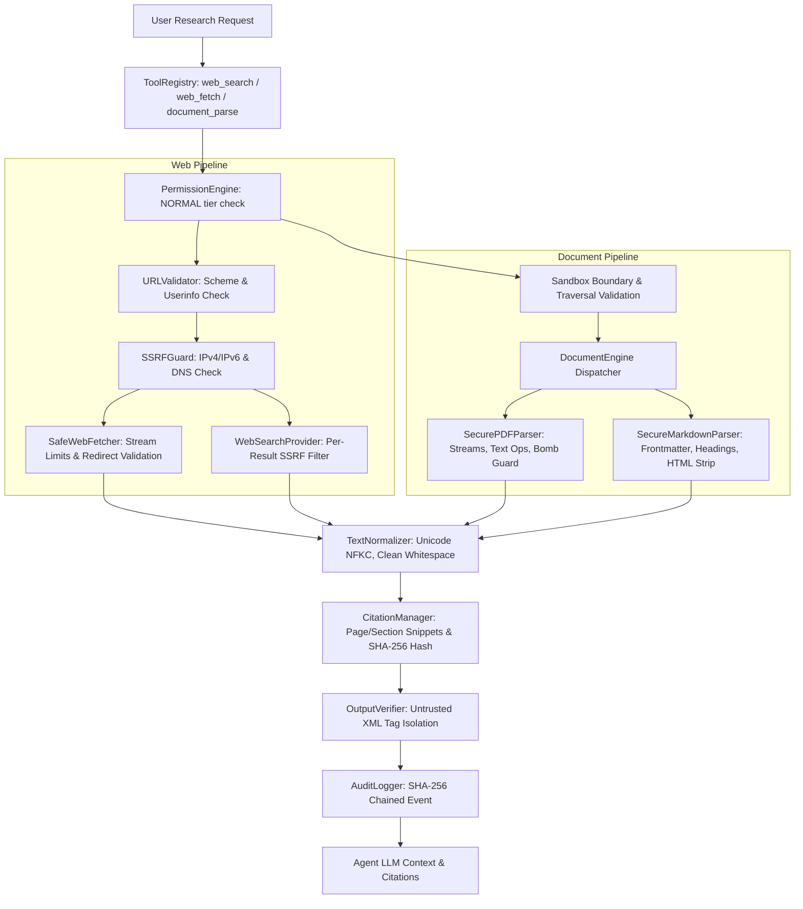

# JARVIS Phase 4: Complete Web & Research Engine

## 1. Executive Summary & Security Posture
Phase 4 provides JARVIS with a comprehensive, secure, sandboxed research capability spanning:
- **Phase 4.1: Secure Web Research Foundation**: Protocol whitelisting (`http`/`https`), credential userinfo rejection, multi-layer IPv4/IPv6 private/metadata SSRF defense (`169.254.169.254`), dynamic DNS resolution checks, redirect hop inspection (max 3), streaming size limits (512 KB), and timeout controls.
- **Phase 4.2: Secure Web Search Engine**: Provider-agnostic search abstraction (`BaseSearchProvider`), hermetic fixtures (`MockSearchProvider`), query length bounds (500 chars), result clamping (1–10), and per-result URL/SSRF filtering.
- **Phase 4 Finalization: Secure Document Parsing & Citation Engine**:
  - Pure-Python secure PDF parser with FlateDecode decompression bomb protection, font encoding resolution, active exploit (/JS, /Launch) neutralization, and metadata extraction.
  - Secure Markdown parser with frontmatter extraction, structural heading hierarchies, link citations, and inline HTML/script stripping.
  - Unicode NFKC and control-character text normalization.
  - Verifiable citation engine tracking page/section anchors and document SHA-256 fingerprints.
  - XML untrusted data isolation (`<untrusted_web_content>`, `<untrusted_search_results>`, `<untrusted_document_content>`) preventing indirect prompt injection.
  - Filesystem sandbox boundary enforcement prohibiting path traversal and system directory escapes.
  - Chained SHA-256 non-repudiable audit logging for all research operations.

---

## 2. Architecture Diagram

---

## 3. Security Controls & Defenses

### A. PDF Security Engine (`research/pdf_parser.py`)
- **Decompression Bomb Protection**: Caps single stream decompression at 10 MB and cumulative document decompression at 50 MB.
- **Active Exploit Neutralization**: Detects and neutralizes executable PDF action tags (`/JS`, `/JavaScript`, `/Launch`, `/EmbeddedFiles`).
- **Zero Binary Dependencies**: Built purely with standard Python library and `zlib`, preventing memory corruption in unvetted C extensions.
- **Page & Size Limits**: Hard caps of 10 MB file size and 200 pages.

### B. Markdown Security Engine (`research/markdown_parser.py`)
- **Inline HTML Sanitization**: Strips dangerous tags (`<script>`, `<style>`, `<iframe>`, `<object>`, `<embed>`, `<form>`, `<button>`) and event handlers (`onclick`, `onload`, `onerror`).
- **Section Structural Integrity**: Organizes headings (`#`, `##`, `###`) into discrete section objects for citation anchoring.
- **Size Bounds**: Maximum file size cap of 2 MB.

### C. Citation Engine (`research/citation.py`)
- **Verifiable Provenance**: Binds citations to exact source URIs, page numbers, section titles, and SHA-256 hashes.
- **Tamper Evidence**: Changes to source documents invalidate the SHA-256 fingerprint.

### D. Untrusted Content Isolation (`agents/verifier.py`)
- Wraps fetched or parsed research content in explicit XML data delimiters:
  - `<untrusted_web_content url="..." title="..." status="...">`
  - `<untrusted_search_results query="..." count="...">`
  - `<untrusted_document_content source="..." title="..." hash="..." type="...">`
- Content instructions inside web pages or documents are treated strictly as passive data and cannot override system prompts or invoke tools.

---

## 4. Phase 4 Tool Suite

| Tool ID | Capability | Permission Tier | Risk Level | Side-Effect Level | Description |
|---|---|---|---|---|---|
| `web_search` | `RESEARCH` | `NORMAL` | `LOW` | `READ` | Queries search engine/fixtures with per-result SSRF filtering. |
| `web_fetch` | `RESEARCH` | `NORMAL` | `LOW` | `READ` | Fetches and cleans web pages with SSRF and redirect validation. |
| `document_parse` | `RESEARCH` | `NORMAL` | `LOW` | `READ` | Parses PDF and Markdown documents, extracting text and citations. |

---

## 5. Verification Results
- **Phase 4.1 Tests**: 24 tests
- **Phase 4.2 Tests**: 14 tests
- **Phase 4 Document Tests**: 18 tests
- **Total Phase 4 Tests**: **56 tests (100% PASS)**
- **Total Suite across all Phases**: **150 tests (100% PASS in 0.992s)**
