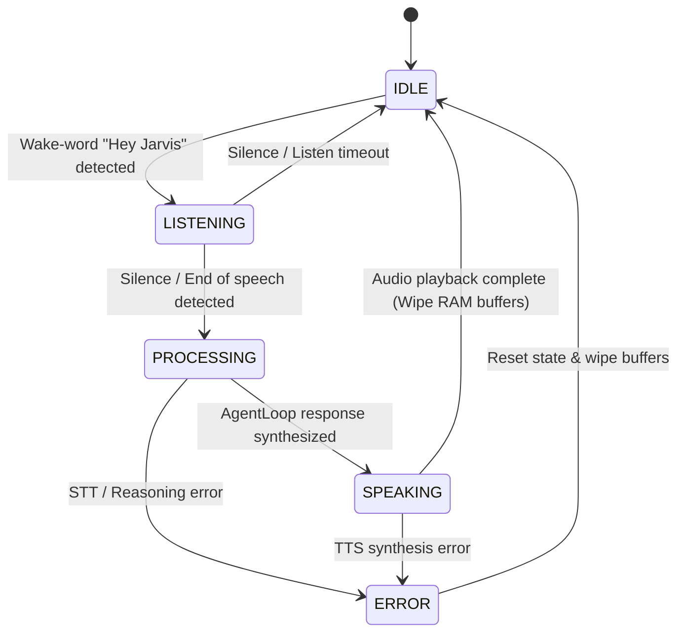
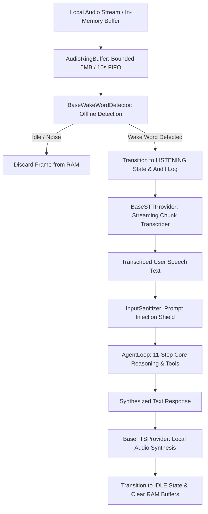

# JARVIS Phase 5: Voice Pipeline Architecture

## 1. Executive Summary & Privacy Posture
Phase 5 introduces the local, privacy-first **Voice Pipeline** for JARVIS. It enables hands-free speech interactions through offline wake-word detection ("Hey Jarvis"), local streaming Speech-to-Text (STT), and on-device Text-to-Speech (TTS) synthesis.

### Strict Privacy & Security Invariants:
1. **Local-Only Processing**: All audio decoding, wake-word spotting, STT inference, and TTS synthesis execute completely locally in memory with zero outbound network communication.
2. **Zero Persistent Audio**: Raw audio frames exist only ephemerally in RAM ring buffers (`AudioRingBuffer`) and are immediately wiped after turn completion. No audio or WAV files are ever written to disk or stored in SQLite.
3. **Audit Logging Without Audio**: Chained SHA-256 audit logs record interaction metadata (event types, durations, token/character counts, confidence metrics) and NEVER raw audio bytes.
4. **Untrusted Speech Input**: All transcribed text from STT is treated as untrusted user input and sanitized through `InputSanitizer` before being passed to `AgentLoop`.
5. **No Permission Bypass**: Voice interaction respects `PermissionLevel.LOCKED` (which denies microphone access) and cannot bypass Human-In-The-Loop (HITL) approval cards for sensitive/destructive operations.

---

## 2. Architecture & State Machine

---

## 3. Subsystem Modules

| Module | Component | Description |
|---|---|---|
| `voice/base.py` | `AudioChunk`, `AudioRingBuffer`, `VoiceState` | Ephemeral in-memory audio chunk representations and bounded FIFO memory buffer. |
| `voice/wake_word.py` | `BaseWakeWordDetector`, `MockWakeWordDetector`, `LocalWakeWordDetector` | Offline wake-word detection engine abstraction. |
| `voice/stt.py` | `BaseSTTProvider`, `MockSTTProvider`, `LocalWhisperSTTProvider` | Local streaming speech-to-text transcriber abstraction. |
| `voice/tts.py` | `BaseTTSProvider`, `MockTTSProvider`, `LocalPiperTTSProvider` | Local text-to-speech synthesis engine abstraction. |
| `voice/pipeline.py` | `VoicePipeline`, `VoiceTurnResult` | State machine orchestrator coordinating WakeWord -> STT -> AgentLoop -> TTS lifecycle. |
| `agents/sanitizer.py` | `InputSanitizer` | Prompt injection neutralizer and Unicode normalizer for speech transcripts. |

---

## 4. Verification & Test Coverage
- **Wake-Word Detection**: Matches valid wake-word signatures; rejects background noise.
- **Streaming STT**: Chunk buffering, duration/confidence calculation, empty/corrupt chunk defense.
- **TTS Synthesis**: Synthesizes structured `SynthesizedAudio` chunks.
- **Bounded Buffer Defense**: Rejects single oversized chunks with `VoiceBufferOverflowError` and evicts oldest chunks in FIFO order.
- **Zero-Persistence & Local-Only**: 0 audio files written to disk; 0 network sockets opened.
- **Permission Gatekeeping**: Blocks voice interaction under `PermissionLevel.LOCKED` with `VoicePermissionDeniedError`.
- **Prompt Injection Defense**: Sanitizes speech containing hostile system instructions.
- **Tamper-Evident Audit Logging**: Chained SHA-256 integrity with zero raw audio bytes stored.
- **Full Suite**: 16 dedicated Phase 5 tests (166 total tests across Phases 1–5 passing 100%).
