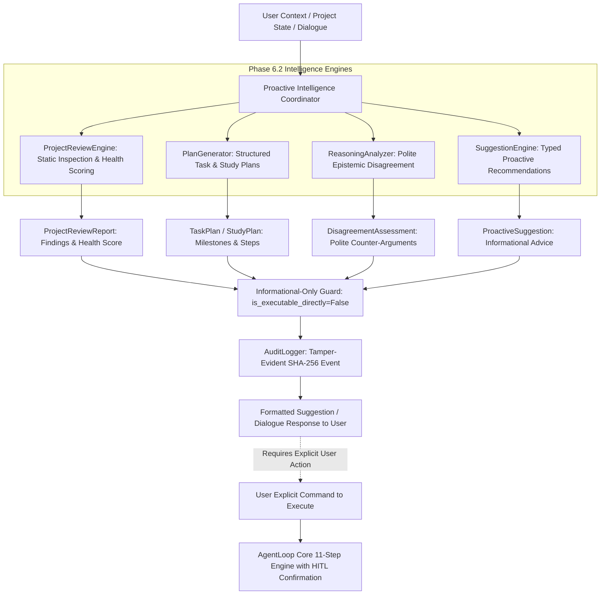

# JARVIS Phase 6.2: Proactive Intelligence & Reasoning Architecture

## 1. Executive Summary & Safety Posture
Phase 6.2 implements the **Proactive Intelligence & Reasoning** engine for JARVIS. It enables autonomous background project reviews, static security and code quality health checks, structured task and study plan generation, and polite epistemic disagreement while upholding strict, non-negotiable safety invariants.

### Strict Safety & Informational Invariant:
> **Zero Unsolicited Tool Execution**: All proactive suggestions, project review findings, and generated plans are **strictly informational**. JARVIS must NEVER trigger tool executions, filesystem writes, network requests, or external side effects merely because a recommendation was produced. Any action requires an explicit, interactive user command.

---

## 2. Architecture Diagram

---

## 3. Subsystem Modules

| Module | Component | Description |
|---|---|---|
| `intelligence/project_reviewer.py` | `ProjectReviewEngine`, `ProjectReviewReport`, `ProjectFinding` | Static analysis and architectural health reviewer evaluating security, code quality, testing, and documentation. |
| `intelligence/plan_generator.py` | `PlanGenerator`, `StructuredPlan`, `PlanMilestone`, `PlanStepItem` | Modular, step-by-step task execution roadmap and learning curriculum generator with deliverables and risk mitigations. |
| `intelligence/analyzer.py` | `ReasoningAnalyzer`, `DisagreementAssessment`, `DisagreementCategory` | Polite epistemic disagreement engine evaluating technical feasibility, crypto weaknesses, safety violations, and dangerous instructions. |
| `intelligence/suggestions.py` | `SuggestionEngine`, `ProactiveSuggestion`, `InformationalGuard` | Priority-weighted recommendation generator with `InformationalGuard` blocking unapproved automated tool execution. |

---

## 4. Security & Safety Invariants

1. **Informational-Only Guard (`InformationalGuard`)**:
   - `InformationalGuard.verify_no_unsolicited_execution(suggestion, is_user_initiated)` throws `ProactiveActionExecutionBlockedError` if any automated routine attempts to execute a tool from a recommendation without user initiation.
2. **Read-Only Project Inspection**:
   - `ProjectReviewEngine` performs strictly read-only traversal over files, inspecting syntax patterns and structure without modifying or deleting files.
3. **Epistemic Honesty & Disagreement**:
   - Detects unsafe instructions (e.g. "disable confirmation gates", "store plaintext passwords", "use MD5", "drop database without backup") and politely articulates counter-propositions matching the JARVIS persona governor.
4. **Audit Trail**:
   - Records `PROACTIVE_REVIEW_COMPLETED`, `TASK_PLAN_GENERATED`, and `DISAGREEMENT_EVALUATED` in `AuditLogger` with SHA-256 chained integrity.

---

## 5. Verification & Test Coverage
- **17 Dedicated Phase 6.2 Tests** in `tests/test_phase6_proactive.py`.
- **183 Total Hermetic Tests** passing 100% across all phases (1–6.2) in 1.082s.
