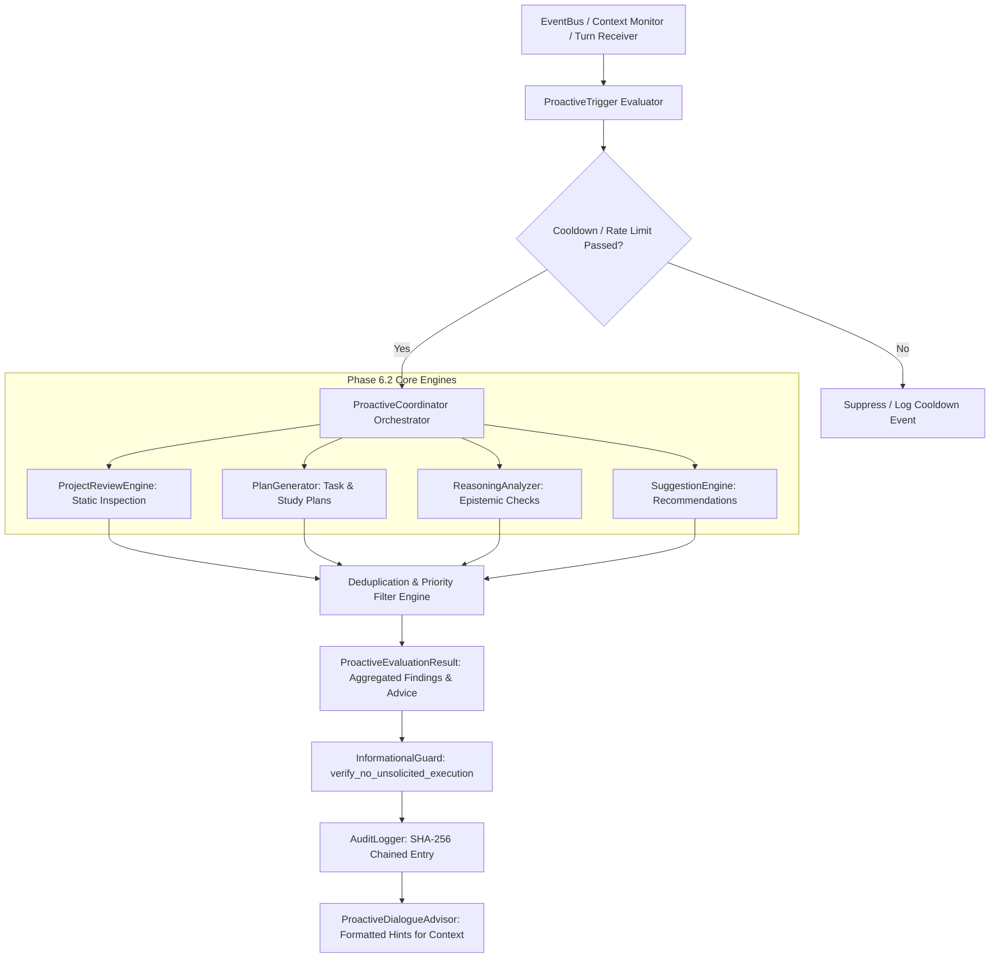

# JARVIS Phase 6.3: Proactive Intelligence Coordinator & Integration Architecture

## 1. Executive Summary & Safety Posture
Phase 6.3 completes the **Proactive Intelligence & Reasoning** subsystem by implementing the central **`ProactiveCoordinator`**, event-driven triggers (`ProactiveTrigger`), rate-limiting cooldown mechanisms, suggestion deduplication, and non-invasive dialogue advisory integration (`ProactiveDialogueAdvisor`).

### Strict Safety & Informational Invariant:
> **Zero Unsolicited Tool Execution**: All outputs from the proactive coordinator remain strictly informational (`is_informational_only = True`, `is_executable_directly = False`). JARVIS must NEVER trigger tool executions, filesystem writes, network requests, or external side effects merely because a proactive recommendation was generated. Any action requires an explicit, interactive user command.

---

## 2. Architecture Diagram

---

## 3. Subsystem Modules

| Module | Component | Description |
|---|---|---|
| `intelligence/coordinator.py` | `ProactiveCoordinator`, `ProactiveTrigger`, `TriggerType`, `ProactiveEvaluationResult` | Central orchestrator coordinating project reviews, plan generation, epistemic checks, and suggestions with rate-limiting and deduplication. |
| `intelligence/dialogue_advisor.py` | `ProactiveDialogueAdvisor` | Formats aggregated proactive evaluation results into inert XML (`<proactive_advisory>`) or human-readable Markdown blocks. |
| `intelligence/suggestions.py` | `SuggestionEngine`, `ProactiveSuggestion`, `InformationalGuard` | Suggestion generator with `InformationalGuard` preventing automated tool execution. |
| `intelligence/project_reviewer.py` | `ProjectReviewEngine`, `ProjectReviewReport`, `ProjectFinding` | Static analysis and architectural health reviewer evaluating security, code quality, and testing. |
| `intelligence/plan_generator.py` | `PlanGenerator`, `StructuredPlan`, `PlanMilestone`, `PlanStepItem` | Step-by-step task execution roadmap and learning curriculum generator. |
| `intelligence/analyzer.py` | `ReasoningAnalyzer`, `DisagreementAssessment`, `DisagreementCategory` | Polite epistemic disagreement engine evaluating technical feasibility and safety violations. |

---

## 4. Security & Safety Invariants

1. **Informational-Only Guard (`InformationalGuard`)**:
   - `InformationalGuard.verify_no_unsolicited_execution(suggestion, is_user_initiated)` throws `ProactiveActionExecutionBlockedError` if any automated routine attempts to execute a tool from a recommendation without user initiation.
2. **Rate-Limiting Cooldown Windows**:
   - Enforces a minimum interval between evaluations of the same `TriggerType`, throwing `ProactiveCooldownActiveError` on rapid invocations unless explicitly forced or triggered via `MANUAL_REQUEST`.
3. **Suggestion Fingerprinting & Deduplication**:
   - Computes deterministic SHA-256 hashes of `(category, title)` to avoid repeated suggestion noise across turns.
4. **Dialogue Non-Invasiveness**:
   - Proactive context is delivered inside inert XML tags (`<proactive_advisory>`) to prevent prompt hijacking or unexpected model execution loops.
5. **Audit Trail**:
   - Records `PROACTIVE_EVALUATION_COMPLETED` in `AuditLogger` with SHA-256 chained integrity.

---

## 5. Verification & Test Coverage
- **14 Dedicated Phase 6.3 Tests** in `tests/test_phase6_3_coordinator.py`.
- **17 Phase 6.2 Tests** in `tests/test_phase6_proactive.py`.
- **197 Total Hermetic Tests** passing 100% across all phases (1–6.3) in 1.105s.
