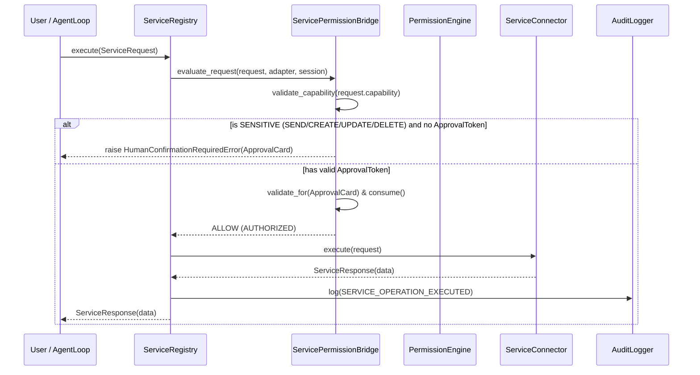

# Phase 9: External Service Integrations & Connector Architecture

## 1. Overview & Architectural Goals

Phase 9 establishes the secure, capability-bounded, and auditable foundation for integrating JARVIS with external third-party services and personal communication channels (Gmail, Google Calendar, Google Drive, Slack, GitHub, Apple Notes, WhatsApp, Telegram).

The external integration layer is designed with strict Defense-in-Depth principles:
1. **Isolated Service Adapters**: Each external service implements a strictly typed `BaseServiceAdapter` contract.
2. **Explicit Capability Manifests**: Services declare granular capabilities (`READ`, `SEARCH`, `CREATE`, `UPDATE`, `DELETE`, `SEND`, `EXECUTE`). Adapters can never execute undeclared capabilities.
3. **HITL Permission Gating**: High-risk capabilities (`SEND`, `DELETE`, `EXECUTE`, `CREATE`, `UPDATE`) strictly require interactive Human-in-the-Loop (`ApprovalCard`) confirmation and issue single-use cryptographic `ApprovalToken` instances.
4. **Platform-Isolated Credential Boundary**: Credential providers (`BaseCredentialProvider`) isolate OAuth tokens, API keys, and Bot tokens in memory or secure hardware keychains. Plaintext credentials are never exposed via status endpoints, metadata dictionaries, string representations, or audit logs.
5. **Non-Repudiable Chained Audit Trail**: Every service operation, registration, enablement, disablement, and revocation writes to the SHA-256 chained audit logger with automated sensitive parameter scrubbing (`[REDACTED]`).
6. **Bounded Health Monitoring & Fault Isolation**: Asynchronous health checks, execution timeouts (15s), and deterministic simulation hooks prevent external API latency from hanging the central `AgentLoop`.

---

## 2. Service Integration Layer (`services/`)

### 2.1 Capability Model (`services/models.py`)

| Capability | Permission Level | Description | Example Operations |
| :--- | :--- | :--- | :--- |
| `READ` | `NORMAL` | Non-destructive data retrieval | `read_inbox`, `list_events`, `list_files`, `read_channel_history`, `list_issues` |
| `SEARCH` | `NORMAL` | Read-only index queries and contact filtering | `search_emails`, `search_events`, `search_files`, `search_messages`, `search_issues` |
| `CREATE` | `SENSITIVE` | Resource generation (Requires HITL) | `create_draft`, `create_event`, `upload_file`, `create_issue` |
| `UPDATE` | `SENSITIVE` | Resource modification (Requires HITL) | `update_event`, `update_file`, `update_issue` |
| `DELETE` | `SENSITIVE` | Resource removal / Trashing (Requires HITL) | `delete_email`, `delete_event`, `delete_file`, `delete_message`, `close_issue` |
| `SEND` | `SENSITIVE` | Outbound external transmission (Requires HITL) | `send_email`, `post_message` |
| `EXECUTE` | `SENSITIVE` | Service-side automation execution (Requires HITL) | `trigger_webhook`, `run_sync` |

### 2.2 Lifecycle & Status Model (`ServiceStatus`)

- `CONNECTED`: Active, authenticated, and ready for operations.
- `DISCONNECTED`: Registered but currently offline or disabled.
- `AUTH_REQUIRED`: Credentials missing, expired, or require OAuth re-authorization.
- `DEGRADED`: Transient rate-limiting (HTTP 429) or elevated upstream latency.
- `REVOKED`: Permanently revoked by user; credentials zeroized and execution halted.
- `ERROR`: Unrecoverable adapter failure or upstream outage (HTTP 503).

---

## 3. Specific Connectors & Adapters (`services/connectors/`)

Phase 9.2 introduces dedicated hermetic connector adapters for primary productivity, communication, and development platforms:

### 3.1 Connector Matrix

| Connector | Service ID | Auth Classification | Declared Capabilities | Operations Supported |
| :--- | :--- | :--- | :--- | :--- |
| **Gmail** | `gmail` | `OAUTH2` | `READ`, `SEARCH`, `CREATE`, `SEND`, `DELETE` | `read_inbox`, `get_email`, `search_emails`, `create_draft`, `send_email`, `delete_email` |
| **Google Calendar** | `google_calendar` | `OAUTH2` | `READ`, `SEARCH`, `CREATE`, `UPDATE`, `DELETE` | `list_events`, `get_event`, `search_events`, `create_event`, `update_event`, `delete_event` |
| **Google Drive** | `google_drive` | `OAUTH2` | `READ`, `SEARCH`, `CREATE`, `UPDATE`, `DELETE` | `list_files`, `read_file`, `search_files`, `upload_file`, `update_file`, `delete_file` |
| **Slack** | `slack` | `BOT_TOKEN` | `READ`, `SEARCH`, `SEND`, `DELETE` | `read_channel_history`, `get_message`, `search_messages`, `post_message`, `delete_message` |
| **GitHub** | `github` | `PERSONAL_ACCESS_TOKEN` | `READ`, `SEARCH`, `CREATE`, `UPDATE`, `DELETE` | `list_issues`, `get_issue`, `search_issues`, `create_issue`, `update_issue`, `close_issue` |

### 3.2 Failure Simulation & Error Taxonomy (`ConnectorSimulationConfig`)

To ensure comprehensive testing without external network dependencies, connectors support configurable simulation hooks:
- `simulate_rate_limit`: Returns `ServiceRateLimitError` (HTTP 429) and transitions connector status to `DEGRADED`.
- `simulate_outage`: Returns `ServiceOutageError` (HTTP 503) and transitions connector status to `ERROR`.
- `simulate_timeout`: Returns `ServiceTimeoutError` without hanging.
- `simulate_auth_failure`: Returns `ServiceAuthenticationError` and transitions status to `AUTH_REQUIRED`.

---

## 4. Central Service Registry & Execution Sequence

---

## 5. Security & Invariant Verification Matrix

| Subsystem / Invariant | Enforcement Mechanism | Phase 9 Verification |
| :--- | :--- | :--- |
| **Capability Boundaries** | Explicit `validate_capability` checks against declared set | `test_undeclared_capability_rejection_across_connectors` |
| **HITL Authorization Gate** | `HumanConfirmationRequiredError` on SENSITIVE capabilities without token | `test_gmail_send_and_delete_hitl_enforcement`, `test_calendar_create_update_delete_hitl`, `test_drive_read_and_upload_hitl`, `test_slack_read_and_post_message_hitl`, `test_github_read_and_create_issue_hitl` |
| **Single-Use Approval Tokens** | Token replay rejection via `ApprovalToken.is_consumed` | `test_token_replay_rejected_across_connectors` |
| **Credential Isolation** | `BaseCredentialProvider` zeroization and non-disclosure | `test_credential_redaction_in_all_connectors` |
| **Secret Scrubbing** | Automatic parameter redaction in `AuditLogger` and exceptions | `test_audit_logging_and_secret_scrubbing` |
| **Fault Isolation & Simulation** | Execution timeouts and failure simulation modes | `test_rate_limiting_simulation`, `test_outage_simulation`, `test_timeout_simulation`, `test_auth_failure_simulation` |
| **IPC Safe Inspection** | Redacted DTO responses for desktop and network companion | `test_ipc_services_list_status_capabilities`, `test_network_bridge_services_endpoints` |

---

## 6. Automated Test Suites

- `tests/test_phase9_1_services.py` (19 automated tests).
- `tests/test_phase9_2_connectors.py` (15 automated tests).
- Total repository tests: **311/311 passing 100% (in 1.446s)**.
