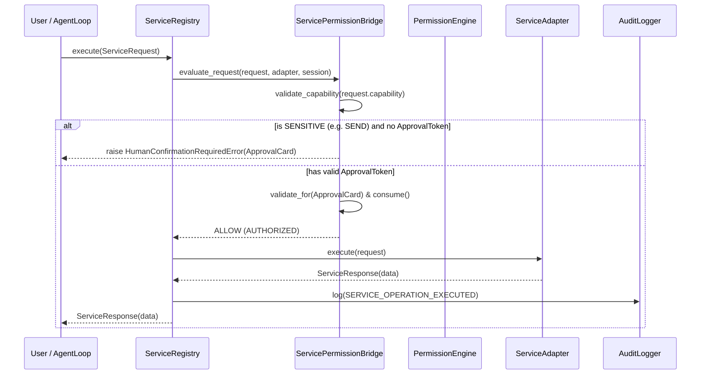

# Phase 9: External Service Integrations & Connector Architecture

## 1. Overview & Architectural Goals

Phase 9 establishes the secure, capability-bounded, and auditable foundation for integrating JARVIS with external third-party services and personal communication channels (e.g. Gmail, Google Calendar, Apple Calendar, WhatsApp, Telegram, Apple Notes).

The external integration layer is designed with strict Defense-in-Depth principles:
1. **Isolated Service Adapters**: Each external service implements a strictly typed `BaseServiceAdapter` contract.
2. **Explicit Capability Manifests**: Services declare granular capabilities (`READ`, `SEARCH`, `CREATE`, `UPDATE`, `DELETE`, `SEND`, `EXECUTE`). Adapters can never execute undeclared capabilities.
3. **HITL Permission Gating**: High-risk capabilities (`SEND`, `DELETE`, `EXECUTE`, `CREATE`, `UPDATE`) strictly require interactive Human-in-the-Loop (`ApprovalCard`) confirmation and issue single-use cryptographic `ApprovalToken` instances.
4. **Platform-Isolated Credential Boundary**: Credential providers (`BaseCredentialProvider`) isolate OAuth tokens and API keys in memory or secure hardware keychains. Plaintext credentials are never exposed via status endpoints, metadata dictionaries, string representations, or audit logs.
5. **Non-Repudiable Chained Audit Trail**: Every service operation, registration, enablement, disablement, and revocation writes to the SHA-256 chained audit logger with automated sensitive parameter scrubbing (`[REDACTED]`).
6. **Bounded Health Monitoring & Fault Isolation**: Asynchronous health checks and execution timeouts prevent external API latency from hanging the central `AgentLoop`.

---

## 2. Service Integration Layer (`services/`)

### 2.1 Capability Model (`services/models.py`)

| Capability | Permission Level | Description | Example Operations |
| :--- | :--- | :--- | :--- |
| `READ` | `NORMAL` | Non-destructive data retrieval | `read_inbox`, `get_event`, `read_note` |
| `SEARCH` | `NORMAL` | Read-only index queries and contact filtering | `search_contacts`, `find_emails` |
| `CREATE` | `SENSITIVE` | Resource generation | `create_draft`, `create_calendar_event` |
| `UPDATE` | `SENSITIVE` | Resource modification | `update_event`, `edit_note` |
| `DELETE` | `SENSITIVE` | Resource removal (Destructive) | `delete_note`, `cancel_meeting` |
| `SEND` | `SENSITIVE` | Outbound external transmission | `send_email`, `send_whatsapp_message` |
| `EXECUTE` | `SENSITIVE` | Service-side automation execution | `trigger_webhook`, `run_sync` |

### 2.2 Lifecycle & Status Model (`ServiceStatus`)

- `CONNECTED`: Active, authenticated, and ready for operations.
- `DISCONNECTED`: Registered but currently offline or disabled.
- `AUTH_REQUIRED`: Credentials missing, expired, or require OAuth re-authorization.
- `DEGRADED`: Transient rate-limiting or elevated upstream latency.
- `REVOKED`: Permanently revoked by user; credentials zeroized and execution halted.
- `ERROR`: Unrecoverable adapter failure.

---

## 3. Central Service Registry (`services/registry.py`)

The `ServiceRegistry` provides unified registration, discovery, dispatch, and administrative controls:

---

## 4. IPC & Network Bridge Service Endpoints

The IPC Unix Domain Socket and Network Bridge servers expose safe service management endpoints:

| JSON-RPC Method | Parameters | Return Type | Description |
| :--- | :--- | :--- | :--- |
| `jarvis.services.list` | `{}` | `{services: [...]}` | Safe metadata list of all registered services. |
| `jarvis.services.status` | `{service_id?: string}` | `{status: string}` or `{statuses: {...}}` | Health status of specific or all services. |
| `jarvis.services.capabilities`| `{service_id: string}` | `{capabilities: [...]}` | Inspect declared capabilities. |
| `jarvis.services.revoke` | `{service_id: string}` | `{status: "REVOKED"}` | Zeroize credentials and revoke service. |

---

## 5. Security & Invariant Verification Matrix

| Subsystem / Invariant | Enforcement Mechanism | Phase 9.1 Verification |
| :--- | :--- | :--- |
| **Capability Boundaries** | Explicit `validate_capability` checks against declared set | `test_undeclared_capability_rejected` |
| **HITL Authorization Gate** | `HumanConfirmationRequiredError` on SENSITIVE capabilities without token | `test_sensitive_send_without_token_raises_hitl_card` |
| **Single-Use Approval Tokens** | Token replay rejection via `ApprovalToken.is_consumed` | `test_sensitive_send_with_valid_single_use_token_succeeds` |
| **Credential Isolation** | `BaseCredentialProvider` zeroization and non-disclosure | `test_credential_non_disclosure_in_repr_and_metadata` |
| **Secret Scrubbing** | Automatic parameter redaction in `AuditLogger` and exceptions | `test_audit_logging_and_secret_scrubbing` |
| **Fault Isolation** | Asynchronous execution timeout and error wrapping | `test_adapter_failure_isolation` |
| **IPC Safe Inspection** | Redacted DTO responses for desktop and network companion | `test_ipc_services_list_status_capabilities`, `test_network_bridge_services_endpoints` |

---

## 6. Automated Test Suites

- `tests/test_phase9_1_services.py` (19 tests covering registration, capability boundaries, HITL gates, credential isolation, health checks, ToolRegistry bridging, and IPC/Network endpoints).
- Total repository tests: **296/296 passing 100% (in 1.324s)**.
