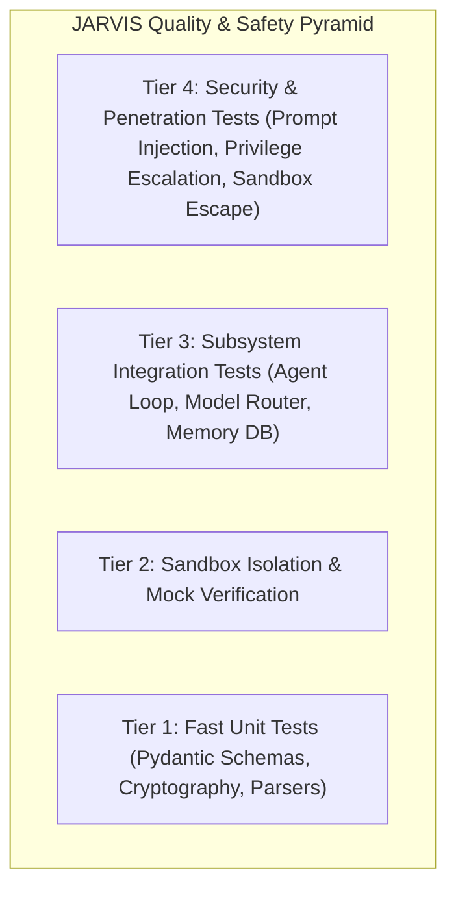

# JARVIS Testing Strategy & Verification Framework

> **Phase 0 — Safe Development Specification**

This document establishes the multi-tiered testing strategy for JARVIS. All tests are designed to execute in an isolated, hermetic test environment using synthetic mock fixtures without touching real user accounts or host data.

---

## 1. Testing Pyramid Overview



---

## 2. Test Suite Categories

### 2.1. Tier 1: Unit Tests (`tests/unit/`)
- **Scope**: Deterministic tests for isolated modules with zero external dependencies.
- **Coverage**:
  - `test_security.py`: Token signing, validation, nonce expiry, audit log hash chain validation.
  - `test_permissions.py`: RBAC/ABAC policy engine, tier boundary checks (`LOCKED` vs `NORMAL` vs `SENSITIVE`).
  - `test_model_router.py`: Routing across Fast, Reasoning, and Local tiers with mock provider fallback.
  - `test_memory.py`: Working memory sliding window, encrypted storage serialization, memory item redaction.
  - `test_agent_loop.py`: Step-by-step state machine transition testing.

### 2.2. Tier 2: Sandbox Isolation Tests (`tests/sandbox/`)
- **Scope**: Validates that all mock services, mock filesystems, and simulated tools remain strictly contained within `sandbox/`.
- **Key Invariants Verified**:
  - No file read or write can escape the virtual sandbox root (`sandbox/fixtures/mock_files/`).
  - Path traversal attempts (`../../../../etc/passwd`, `~/.ssh`) throw immediate security exceptions.
  - Mock services return strictly synthetic fixtures.

### 2.3. Tier 3: Subsystem Integration Tests
- **Scope**: Multi-module coordination (e.g., Agent Loop $\rightarrow$ Permission Engine $\rightarrow$ Tool Registry $\rightarrow$ Sanitizer $\rightarrow$ Audit Log).
- **Key Invariants Verified**:
  - Sensitive actions halt and require an `ApprovalToken`.
  - Rejection of approval cancels execution cleanly without side-effects.

### 2.4. Tier 4: Security & Adversarial Tests (`tests/security/`)
- **Direct Prompt Injection Test Suite**: Ingests known jailbreak strings (DAN, Developer Mode, Role Reversal) and verifies agent does not execute unauthorized tools.
- **Indirect Prompt Injection Test Suite**: Feeds synthetic emails and webpages containing hidden instruction overrides; verifies content is treated as untrusted data.
- **Data Leakage & Sanitization Tests**: Verifies API keys, credit cards, and PII are redacted before dispatch to cloud model mock endpoints.
- **Privilege Escalation Tests**: Verifies an unauthenticated session cannot elevate its tier to `SENSITIVE`.

---

## 3. Test Execution Commands

```bash
# Run all test suites (Phase 1 Core + Phase 2 Secure Memory, 36 tests)
python3.12 -m unittest discover -s tests -v

# Run specifically the Phase 2 Memory Subsystem test suite
python3.12 -m unittest tests/test_phase2_memory.py -v

# Run specifically the Phase 1 Core test suite
python3.12 -m unittest tests/test_phase1_all.py -v
```

---

## 4. Continuous Integration (CI) Safety Gatekeepers

All automated pull requests and branches must satisfy:
1. 100% test pass rate across all suites.
2. Zero `mypy --strict` type checking errors.
3. 0 high or critical vulnerabilities identified by static analysis (`bandit`, `ruff`).
4. Zero disk or network access outside the designated sandbox root.
