# JARVIS Voice Pipeline Architecture

> **Phase 0 — Safe Development Specification**

This document specifies the audio processing topology, wake-word detection architecture, streaming Speech-to-Text (STT), Text-to-Speech (TTS) synthesis, and conversational turn management for **JARVIS**.

---

## ⚠️ Phase 0 Safety Boundary

**No microphone hardware, audio recording streams, or wake-word engines are activated during Phase 0.**
All voice subsystems in Phase 0 are represented by typed interfaces, data structures, and mock pipeline stubs.

---

## 1. High-Level Voice Topology

```mermaid
flowchart LR
    subgraph AudioInput["Audio Capture & STT (On-Device)"]
        Mic[Microphone Hardware] -->|Audio Stream| VAD[Voice Activity Detector]
        VAD -->|Active Voice| WakeWord[OpenWakeWord Engine<br/>'Hey Jarvis']
        WakeWord -->|Wake Event| LocalSTT[Local Whisper / Moonshine Engine]
        LocalSTT -->|Streaming Text Tokens| IntentRouter[Core Agent Loop]
    end

    subgraph AudioOutput["TTS & Playback (On-Device)"]
        IntentRouter -->|Synthesized Response| LocalTTS[Piper / macOS AVFoundation TTS]
        LocalTTS -->|PCM Audio Stream| Speaker[Speaker / Headphone Output]
    end
```

---

## 2. Component Specifications

### 2.1. Wake-Word Engine ("Hey Jarvis")
- **Target Technology**: OpenWakeWord (fully open-source, runs locally on CPU/NPU) or Porcupine.
- **Privacy Design**:
  - The wake-word model runs on an ultra-compact continuous circular audio buffer (max 3 seconds) entirely in volatile RAM.
  - Zero audio frames are saved to disk or transmitted over the network while awaiting the wake phrase.
  - Activation threshold is calibrated to minimize false triggers.

### 2.2. Speech-to-Text (STT) Subsystem
- **Target Technology**: OpenAI Whisper (quantized GGUF via whisper.cpp) or Moonshine STT for low-latency on-device streaming.
- **Streaming Pipeline**:
  - Voice Activity Detection (VAD via Silero VAD) detects speech onset and cessation.
  - Audio frames are streamed to the local transcriber in 250ms chunks.
  - Punctuation and formatting are resolved locally before passing normalized text to the agent loop.

### 2.3. Text-to-Speech (TTS) Subsystem
- **Target Technology**: Piper TTS (high-quality, fast local neural voice) or native macOS `AVSpeechSynthesizer` / Android `TextToSpeech`.
- **Persona Acoustic Profile**:
  - Calm, articulate, British-inspired or crisp neutral tone.
  - Dynamic prosody adjustment based on formal ("Sir") vs private ("Suprith") context.

### 2.4. Conversational Turn Management & Barge-In (Interruption)
- **Continuous Conversation**: Once awakened, JARVIS maintains an active listening state for 8 seconds after speaking. If the user continues speaking, no wake-phrase repetition is needed.
- **Barge-In Handling**: If the user speaks while JARVIS is outputting audio, the VAD immediately cuts off TTS audio playback (`audio_sink.stop()`) and seamlessly transitions to transcribing the user's interruption.

---

## 3. Startup & System Readiness

- **Ready State**: Upon user login to macOS or unlock of the Android device, the JARVIS Voice Daemon initializes background models and enters the `READY` listening state (when voice mode is enabled by user configuration in Phase 5).
- **Visual Feedback**: The desktop floating HUD or menu bar icon illuminates to indicate listening, thinking, and speaking states.
